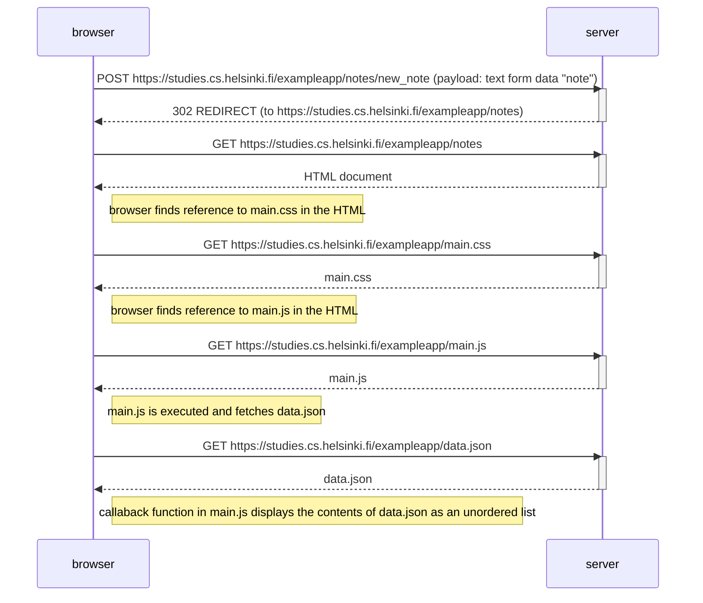

Sequence diagram for saving a new note on https://studies.cs.helsinki.fi/exampleapp/notes :

```mermaid
sequenceDiagram
  participant browser
  participant server

  browser->>server: POST https://studies.cs.helsinki.fi/exampleapp/notes/new_note (payload: text form data "note")
  activate server
  server-->>browser: 302 REDIRECT (to https://studies.cs.helsinki.fi/exampleapp/notes)
  deactivate server

  browser->>server: GET https://studies.cs.helsinki.fi/exampleapp/notes
  activate server
  server-->>browser: HTML document
  deactivate server

  Note right of browser: browser finds reference to main.css in the HTML

  browser->>server: GET https://studies.cs.helsinki.fi/exampleapp/main.css
  activate server
  server-->>browser: main.css
  deactivate server

  Note right of browser: browser finds reference to main.js in the HTML

  browser->>server: GET https://studies.cs.helsinki.fi/exampleapp/main.js
  activate server
  server-->>browser: main.js
  deactivate server

  Note right of browser: main.js is executed and fetches data.json

  browser->>server: GET https://studies.cs.helsinki.fi/exampleapp/data.json
  activate server
  server-->>browser: data.json
  deactivate server

  Note right of browser: callaback function in main.js displays the contents of data.json as an unordered list
```
