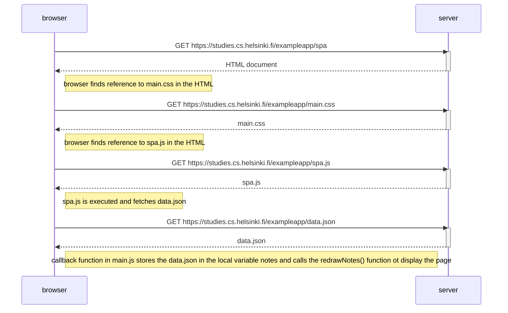

Sequence diagram for loading the single-page style app at https://studies.cs.helsinki.fi/exampleapp/spa

(NB: This is pretty much exactly the same as the previous https://studies.cs.helsinki.fi/exampleapp/notes app since almost only the submitting of a new note differs)

