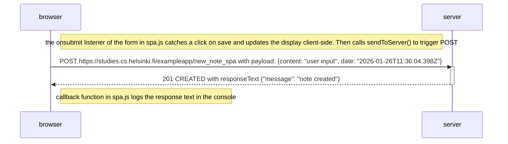

Sequence diagram for submitting a new note on the single-page style app at https://studies.cs.helsinki.fi/exampleapp/spa

```mermaid
sequenceDiagram
  participant browser
  participant server

  Note right of browser: the onsubmit listener of the form in spa.js catches a click on save and updates the display client-side. Then calls sendToServer() to trigger POST

  browser->>server: POST https://studies.cs.helsinki.fi/exampleapp/new_note_spa with payload: {content: "user input", date: "2026-01-26T11:36:04.398Z"}
  activate server
  server-->>browser: 201 CREATED with responseText {"message": "note created"}
  deactivate server

  Note right of browser: callback function in spa.js logs the response text in the console
```
